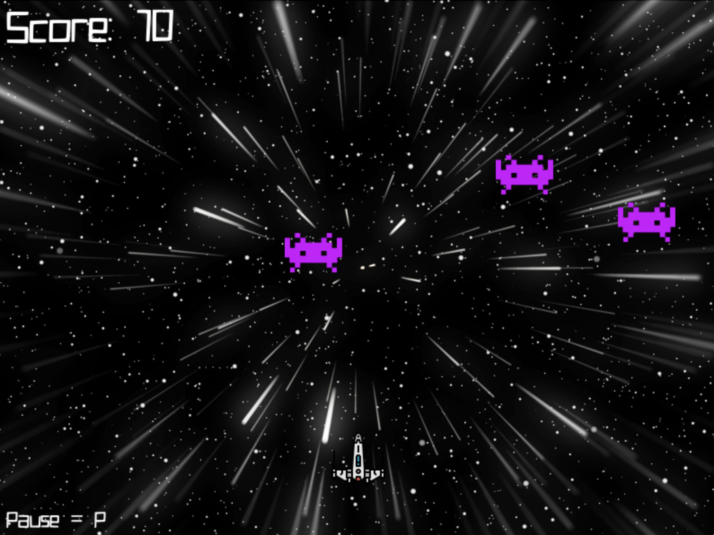

# Space Invaders - Pygame Edition

A retro-style **Space Invaders** game built using Python and Pygame, with support for both **keyboard and controller input**, **sound effects**, **explosions**, **increasing difficulty**, and **interactive menus**.



## Features

* 🎮 Controller & Keyboard input support
* 🔊 Background music and sound effects
* 👾 Multiple alien enemies with increasing difficulty
* 💥 Laser collisions and explosions
* 📈 Dynamic difficulty scaling
* ⏸️ Pause menu with mouse interactivity
* 🔁 Start and Game Over screens

## Getting Started

### Prerequisites

* Python 3.7+
* Pygame
* NumPy

Install dependencies with:

```bash
pip install pygame numpy
```

### Download

Clone this repository to your local machine:

```bash
git clone https://github.com/yourusername/pygame-space-invaders.git
cd pygame-space-invaders
```

Make sure the following directories and files are included:

```
images/
  ├── space.jpg
  ├── spaceship.png
  ├── battleship.png
  ├── alien.png
  ├── blast.png
  └── screenshot.png

sounds/
  ├── techno.mp3
  ├── laser.mp3
  ├── explode.mp3
  └── game_over.mp3

fonts/
  └── QuirkyRobot.ttf
```

Then run the game with:

```bash
python space_invaders.py
```
